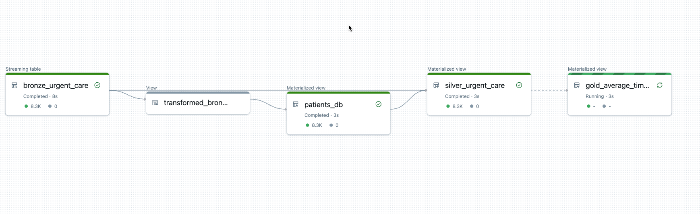
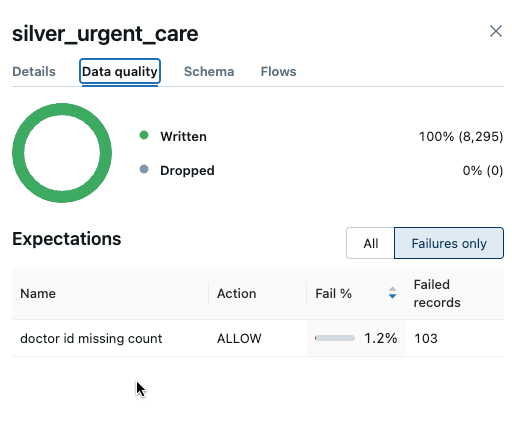
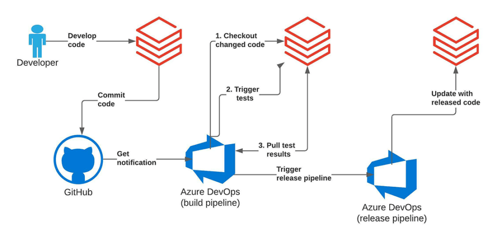

# Simulation Data Engineering - Part 2

The first part of this project [here](https://github.com/Ya5s3r/ae-sim-data-engineering) orchestrated simulation data generation, which eventually landed in Azure storage.

This part now deploys a Databricks Asset Bundle (DAB) - which is infrastructure as code for Databricks.

This allows for CI/CD integration - which has been set up here using GitHub Actions.

The actions produce two environments - development and production. A staging env could also be added.

The deployment to Databricks includes an ELT pipeline, developed using Delta Live Tables. Which is 
a *declarative ETL/ELT framework for the Databricks Data Intelligence Platform* [link](https://www.databricks.com/product/delta-live-tables)

The ELT pipeline uses a medallion data design pattern and is in development.

### ELT Structure



The Delta Live Tables allow for data quality checks as *expectations*. These can cause multiple behaviours, such as
pipeline failures or logging of failed rows. Such as below where we log missing values in a field.



The CI/CD workflow roughly follows the below pattern, as described [here](https://www.databricks.com/blog/2021/09/20/part-1-implementing-ci-cd-on-databricks-using-databricks-notebooks-and-azure-devops.html)
Albeit with some minor adjustments - we don't have a staging area here, although this can easily be added, we use
GitHub Actions here, rather than Azure DevOps. In addition, for demo purposes we are building the dev and prod environments
in the same workspace. If done in reality, we would use separate workspaces.



## Getting started

Below are some general DAB instructions. You would need to setup a Databricks workspace and get the host name, setup
a service principal, set permissions and authenticate.

1. Install the Databricks CLI from https://docs.databricks.com/dev-tools/cli/databricks-cli.html

2. Authenticate to your Databricks workspace, if you have not done so already:
    ```
    $ databricks configure
    ```

3. To deploy a development copy of this project, type:
    ```
    $ databricks bundle deploy --target dev
    ```
    (Note that "dev" is the default target, so the `--target` parameter
    is optional here.)

    This deploys everything that's defined for this project.
    For example, the default template would deploy a job called
    `[dev yourname] ae_sim_job` to your workspace.
    You can find that job by opening your workpace and clicking on **Workflows**.

4. Similarly, to deploy a production copy, type:
   ```
   $ databricks bundle deploy --target prod
   ```

   Note that the default job from the template has a schedule that runs every day
   (defined in resources/ae_sim_job.yml). The schedule
   is paused when deploying in development mode (see
   https://docs.databricks.com/dev-tools/bundles/deployment-modes.html).

5. To run a job or pipeline, use the "run" command:
   ```
   $ databricks bundle run
   ```

6. Optionally, install developer tools such as the Databricks extension for Visual Studio Code from
   https://docs.databricks.com/dev-tools/vscode-ext.html.

7. For documentation on the Databricks asset bundles format used
   for this project, and for CI/CD configuration, see
   https://docs.databricks.com/dev-tools/bundles/index.html.
